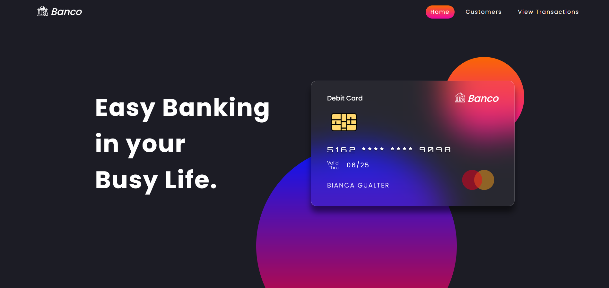
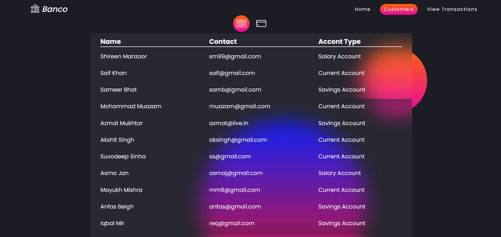
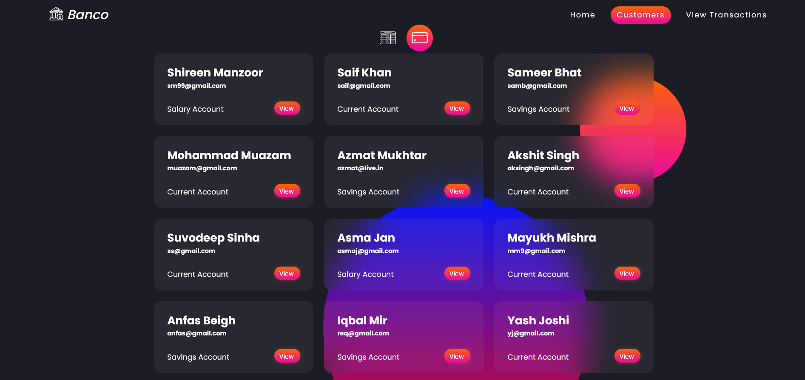
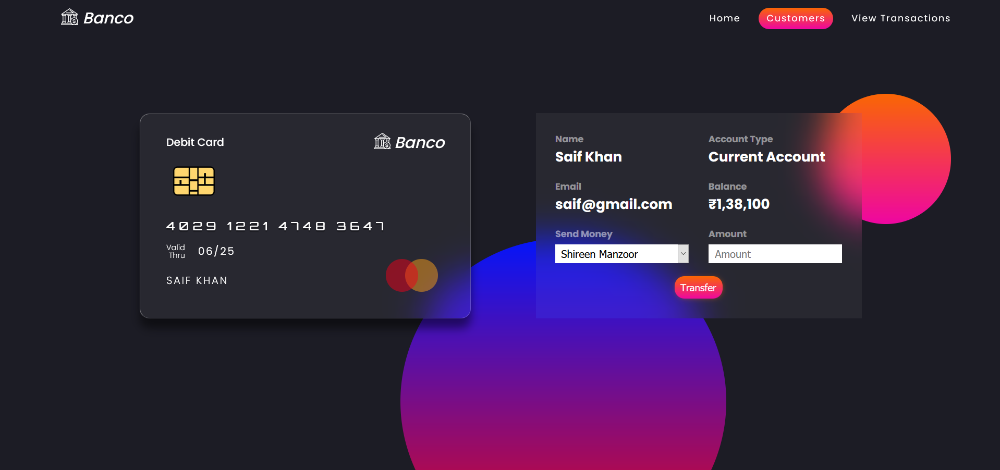
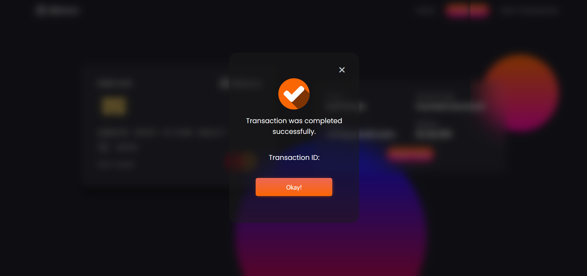
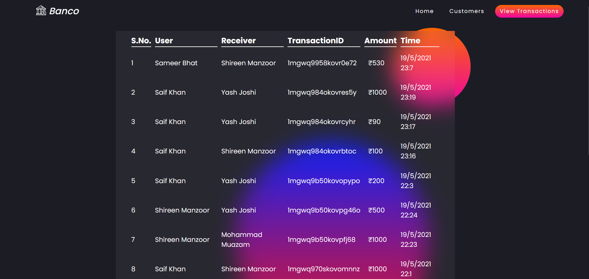

# #GRIPMAY21-task1 Basic Banking System

◇ Create a simple dynamic website which has the following specs. 
◇ Start with creating a dummy data in database for upto 10
customers. Database options: Mysql, Mongo, Postgres, etc.
Customers table will have basic fields such as name, email,
current balance etc. Transfers table will record all transfers
happened. 
◇ Flow: Home Page > View all Customers > Select and View one
Customer > Transfer Money > Select customer to transfer to >
View all Customers . 
◇ No Login Page. No User Creation. Only transfer of money
between multiple users. 
◇ Host the website at 000webhost, github.io, heroku app or any
other free hosting provider. Check in code in gitlab. 

# Tech Stack
- NodeJS with Express
- MySQL
- EJS
- CSS
- JavaScript and jQuery

# Website

  
   
  
  
   
  

